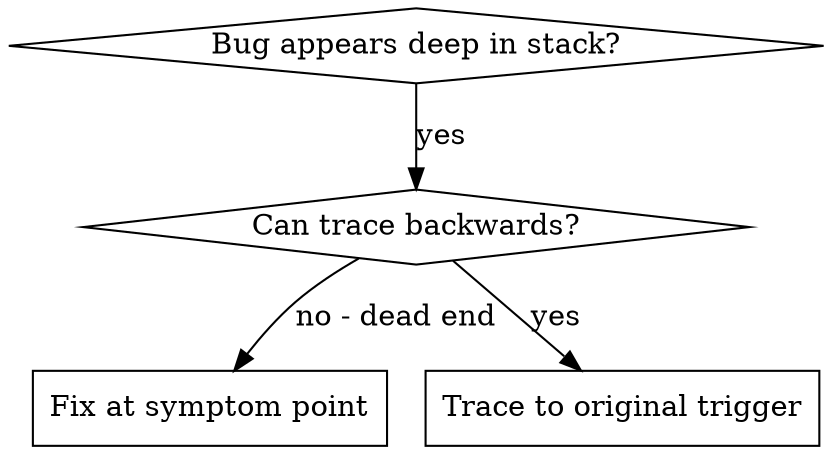
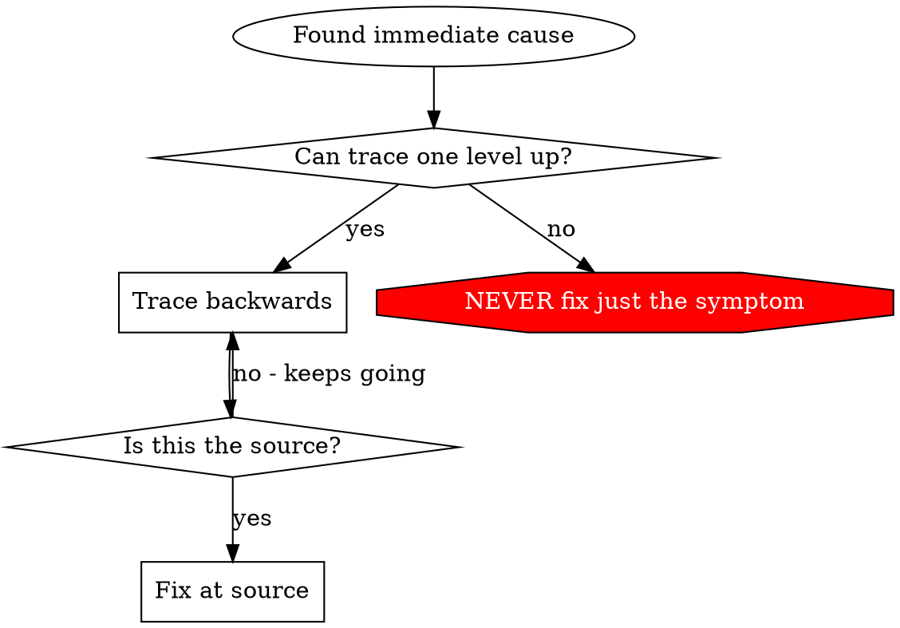

# Root Cause Tracing

## Overview

Bugs often manifest deep in the call stack (git init in wrong directory, file created in wrong location, database opened with wrong path). Your instinct is to fix where the error appears, but that's treating a symptom.

**Core principle:** Trace backward through the call chain until you find the original trigger, then fix at the source.

## When to Use



**Use when:**

- Error happens deep in execution (not at entry point)
- Stack trace shows long call chain
- Unclear where invalid data originated
- Need to find which test/code triggers the problem

## The Tracing Process

### 1. Observe the Symptom

```
Error: git init failed in /Users/jesse/project/packages/core
```

### 2. Find Immediate Cause

**What code directly causes this?**

**TypeScript:**
```typescript
await execFileAsync('git', ['init'], { cwd: projectDir });
```

**Clojure:**
```clojure
(shell/sh "git" "init" :dir project-dir)
```

### 3. Ask: What Called This?

**TypeScript:**
```typescript
WorktreeManager.createSessionWorktree(projectDir, sessionId)
  → called by Session.initializeWorkspace()
  → called by Session.create()
  → called by test at Project.create()
```

**Clojure:**
```clojure
(worktree/create-session-worktree project-dir session-id)
  → called by (session/initialize-workspace)
  → called by (session/create)
  → called by test at (project/create)
```

### 4. Keep Tracing Up

**What value was passed?**

- `projectDir = ''` / `project-dir = nil` (empty/nil!)
- Empty string/nil as directory resolves to `process.cwd()` / `(System/getProperty "user.dir")`
- That's the source code directory!

### 5. Find Original Trigger

**Where did the bad value come from?**

**TypeScript:**
```typescript
const context = setupCoreTest(); // Returns { tempDir: '' }
Project.create('name', context.tempDir); // Accessed before beforeEach!
```

**Clojure:**
```clojure
(def test-system (setup-test-system)) ; Returns {:project-dir nil}
(project/create "name" (:project-dir test-system)) ; Accessed before fixture!
```

## Adding Stack Traces

When you can't trace manually, add instrumentation:

**TypeScript:**
```typescript
// Before the problematic operation
async function gitInit(directory: string) {
  const stack = new Error().stack;
  console.error('DEBUG git init:', {
    directory,
    cwd: process.cwd(),
    nodeEnv: process.env.NODE_ENV,
    stack,
  });

  await execFileAsync('git', ['init'], { cwd: directory });
}
```

**Clojure:**
```clojure
(require '[clojure.stacktrace :as st])

(defn git-init [directory]
  ;; Capture and print stack trace to stderr
  (let [stack (with-out-str (st/print-stack-trace (Exception.)))]
    (binding [*out* *err*]
      (prn "DEBUG git init:"
           {:directory directory
            :cwd (System/getProperty "user.dir")
            :stack stack})))
  ;; Simpler alternative: (Thread/dumpStack)

  (shell/sh "git" "init" :dir directory))
```

**Critical:** Use `console.error()` (JS) or `(binding [*out* *err*] ...)` (Clojure) - logger may be suppressed

**Run and capture:**

```bash
# npm projects
npm test 2>&1 | grep 'DEBUG git init'

# Clojure with Kaocha
clj -M:test --focus my.ns/test-name 2>&1 | grep 'DEBUG'

# Babashka
bb test --focus com.example.the-ns/the-test-name
```

**Analyze stack traces:**

- Look for test file names
- Find the line number triggering the call
- Identify the pattern (same test? same parameter?)

## Finding Which Test Causes Pollution

If something appears during tests but you don't know which test:

Use the bisection script: @find-polluter.sh

```bash
./find-polluter.sh '.git' 'src/**/*.test.ts'
```

Runs tests one-by-one, stops at first polluter. See script for usage.

## Real Examples

### TypeScript: Empty projectDir

**Symptom:** `.git` created in `packages/core/` (source code)

**Trace chain:**

1. `git init` runs in `process.cwd()` ← empty cwd parameter
2. WorktreeManager called with empty projectDir
3. Session.create() passed empty string
4. Test accessed `context.tempDir` before beforeEach
5. setupCoreTest() returns `{ tempDir: '' }` initially

**Root cause:** Top-level variable initialization accessing empty value

**Fix:** Made tempDir a getter that throws if accessed before beforeEach

**Also added validation at multiple layers:**

- Layer 1: Project.create() validates directory
- Layer 2: WorkspaceManager validates not empty
- Layer 3: NODE_ENV guard refuses git init outside tmpdir
- Layer 4: Stack trace logging before git init

### Clojure: Wrong Database Path

**Symptom:** Database file created in project root instead of temp directory

**Trace chain:**

1. `(jdbc/execute! ds ...)` fails with permission/path error
2. `db/init-db` called with `nil` path → defaults to current dir
3. `core/start-system` passed `nil` from config map
4. Test accessed `(:db-path test-system)` before `use-fixtures :each` ran
5. `setup-test-system` returns `{:db-path nil}` before fixture initializes it

**Root cause:** Accessing system map at top-level before fixture setup

**Fix:** Made db-path a delay that throws if accessed before fixture:

```clojure
(defn setup-test-system []
  (let [initialized? (atom false)
        db-path (atom nil)]
    {:db-path (delay
                (when-not @initialized?
                  (throw (ex-info "Accessed db-path before fixture setup!" {})))
                @db-path)
     :initialize! (fn [path]
                    (reset! db-path path)
                    (reset! initialized? true))}))
```

**Also added validation:**

- Layer 1: `db/init-db` validates path is non-nil and absolute
- Layer 2: Assert db-path is under temp directory in tests
- Layer 3: Stack trace logging before database operations

## Key Principle



**NEVER fix just where the error appears.** Trace back to find the original trigger.

## Stack Trace Tips

| Concern | TypeScript | Clojure |
|---------|------------|---------|
| Print to stderr | `console.error()` | `(binding [*out* *err*] (println ...))` |
| Get stack trace | `new Error().stack` | `(st/print-stack-trace (Exception.))` |
| Show cause chain | Manual traversal | `(st/print-cause-trace ex)` |
| JVM flag | N/A | `-XX:-OmitStackTraceInFastThrow` |

**General tips:**
- **In tests:** Use stderr printing, not logger (may be suppressed)
- **Before operation:** Log before the dangerous operation, not after it fails
- **Include context:** Directory, cwd, environment variables, timestamps

## Reading Clojure Stack Traces

Clojure compiles to JVM bytecode, so stack traces show Java class names. Learn to decode them:

**Naming conventions:**
- `my.namespace/my-fn` → `my.namespace$my_fn` (hyphens become underscores)
- `my.namespace/-main` → `my.namespace$_main` (leading hyphen becomes underscore)

**Anonymous functions:**
- `my.namespace$parent_fn$fn__123.invoke` - anonymous fn inside `parent-fn`

**Filter the noise:**
- Ignore `clojure.lang.*`, `clojure.core.*`, `clojure.main` initially
- Look for your namespace first (find the `$` and read the function name)

**Find root cause:**
- Look for "Caused by:" lines - these show the exception chain
- The last "Caused by:" is often the real issue

**JVM gotcha:**
- If stack traces are incomplete, add JVM flag: `-XX:-OmitStackTraceInFastThrow`
- This disables HotSpot optimization that elides repeated exception stacks

## Real-World Impact

From debugging session (2025-10-03):

- Found root cause through 5-level trace
- Fixed at source (getter validation)
- Added 4 layers of defense
- 1847 tests passed, zero pollution
